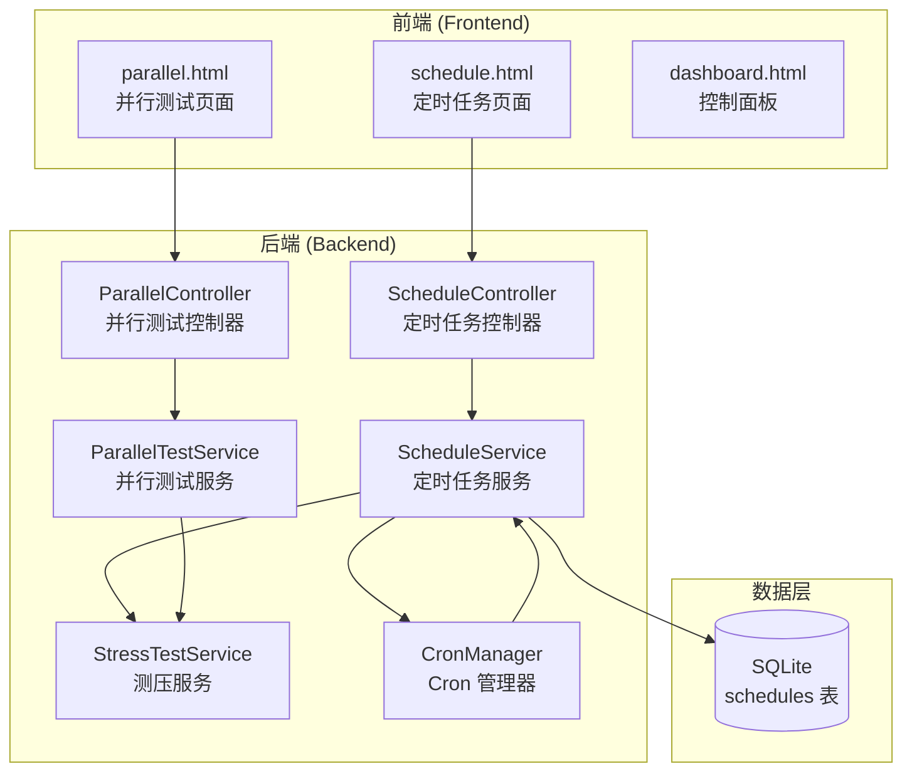

# 设计文档

## 概述

本设计文档描述了 AutoCeya 压力测试系统的高级功能，包括定时任务和多任务并行测试。定时任务允许用户预设测试执行时间，系统自动执行；并行测试允许同时测试多个 API 端点进行性能对比。

## 架构



## 组件和接口

### 1. ScheduleService 类

定时任务服务，管理定时任务的创建、执行和调度。

```javascript
/**
 * 定时任务服务类
 */
class ScheduleService {
  /**
   * 创建定时任务
   * @param {Object} config - 任务配置
   * @returns {Object} 创建的任务
   */
  create(config) {}
  
  /**
   * 获取所有定时任务
   * @returns {Array} 任务列表
   */
  getAll() {}
  
  /**
   * 获取单个任务详情
   * @param {number} id - 任务 ID
   * @returns {Object} 任务详情
   */
  getById(id) {}
  
  /**
   * 更新任务配置
   * @param {number} id - 任务 ID
   * @param {Object} config - 新配置
   * @returns {Object} 更新后的任务
   */
  update(id, config) {}
  
  /**
   * 删除任务
   * @param {number} id - 任务 ID
   */
  delete(id) {}
  
  /**
   * 切换任务启用状态
   * @param {number} id - 任务 ID
   * @returns {Object} 更新后的任务
   */
  toggle(id) {}
  
  /**
   * 执行任务
   * @param {number} id - 任务 ID
   */
  async execute(id) {}
}
```

### 2. CronManager 类

Cron 表达式管理器，负责解析和调度定时任务。

```javascript
/**
 * Cron 管理器类
 */
class CronManager {
  /**
   * 启动调度器
   */
  start() {}
  
  /**
   * 停止调度器
   */
  stop() {}
  
  /**
   * 添加定时任务
   * @param {Object} schedule - 任务配置
   */
  addJob(schedule) {}
  
  /**
   * 移除定时任务
   * @param {number} id - 任务 ID
   */
  removeJob(id) {}
  
  /**
   * 计算下次执行时间
   * @param {string} cronExpression - Cron 表达式
   * @returns {Date} 下次执行时间
   */
  getNextRunTime(cronExpression) {}
  
  /**
   * 验证 Cron 表达式
   * @param {string} cronExpression - Cron 表达式
   * @returns {boolean} 是否有效
   */
  validateCron(cronExpression) {}
}
```

### 3. ParallelTestService 类

并行测试服务，管理多个测试的同时执行。

```javascript
/**
 * 并行测试服务类
 */
class ParallelTestService {
  /**
   * 启动并行测试
   * @param {Array} configs - 测试配置数组（最多5个）
   * @returns {Object} 并行测试状态
   */
  start(configs) {}
  
  /**
   * 停止所有并行测试
   */
  stop() {}
  
  /**
   * 获取所有并行测试状态
   * @returns {Array} 测试状态数组
   */
  getStatus() {}
  
  /**
   * 获取单个测试状态
   * @param {string} testId - 测试 ID
   * @returns {Object} 测试状态
   */
  getTestStatus(testId) {}
}
```

## 数据模型

### 定时任务表 (schedules)

```sql
CREATE TABLE schedules (
  id INTEGER PRIMARY KEY AUTOINCREMENT,
  name TEXT NOT NULL,
  description TEXT,
  test_config TEXT NOT NULL,  -- JSON 格式的测试配置
  schedule_type TEXT NOT NULL, -- 'once' 或 'recurring'
  run_at TEXT,                 -- 一次性执行时间 (ISO 8601)
  cron_expression TEXT,        -- Cron 表达式（重复执行）
  enabled INTEGER DEFAULT 1,   -- 是否启用
  last_run_at TEXT,           -- 上次执行时间
  next_run_at TEXT,           -- 下次执行时间
  created_at TEXT DEFAULT CURRENT_TIMESTAMP,
  updated_at TEXT DEFAULT CURRENT_TIMESTAMP
);
```

### 定时任务配置

```javascript
{
  name: string,           // 任务名称
  description: string,    // 任务描述
  testConfig: {
    url: string,
    modelName: string,
    apiKey: string,
    providerType: string,
    mode: string,
    rpm: number,
    testDuration: number,
    // ... 其他测试配置
  },
  scheduleType: 'once' | 'recurring',
  runAt: string,          // 一次性执行时间
  cronExpression: string, // Cron 表达式
  enabled: boolean,
}
```

### 并行测试状态

```javascript
{
  parallelId: string,     // 并行测试 ID
  startTime: string,      // 开始时间
  tests: [
    {
      testId: string,
      config: Object,     // 测试配置
      status: 'running' | 'completed' | 'failed',
      stats: {
        totalRequests: number,
        successCount: number,
        failureCount: number,
        successRate: number,
        avgResponseTime: number,
        currentRPM: number,
      },
    },
    // ... 最多5个测试
  ],
}
```

## 正确性属性

*属性是一种特征或行为，应该在系统的所有有效执行中保持为真——本质上是关于系统应该做什么的形式化陈述。属性作为人类可读规范和机器可验证正确性保证之间的桥梁。*

### Property 1: 定时任务 CRUD 操作正确性

*对于任意* 有效的任务配置，创建任务后应该能够通过 ID 查询到该任务，更新后配置应该反映新值，删除后应该无法查询到该任务。

**验证: 需求 1.1, 1.2, 2.3, 2.4, 2.5**

### Property 2: Cron 表达式解析正确性

*对于任意* 有效的 Cron 表达式，getNextRunTime 返回的时间应该符合 Cron 表达式定义的规则。

**验证: 需求 1.3**

### Property 3: 并行测试配置限制

*对于任意* 并行测试请求，当配置数量超过 5 个时，系统应该拒绝请求并返回错误。

**验证: 需求 3.1**

### Property 4: 并行测试状态完整性

*对于任意* 正在运行的并行测试，getStatus 返回的状态应该包含所有测试的 testId、status 和 stats（成功率、平均响应时间、当前 RPM）。

**验证: 需求 3.3, 4.2**

## 错误处理

1. **无效 Cron 表达式**: 返回 400 错误，说明表达式格式问题
2. **任务不存在**: 返回 404 错误
3. **并行测试配置超限**: 返回 400 错误，说明最多支持 5 个配置
4. **测试执行失败**: 记录错误日志，更新任务状态

## 测试策略

### 单元测试

- 测试 CronManager 的 Cron 表达式解析
- 测试 ScheduleService 的 CRUD 操作
- 测试 ParallelTestService 的配置验证

### 属性测试

使用 `fast-check` 库：

1. **CRUD 操作测试**: 生成随机任务配置，验证 CRUD 操作正确性
2. **Cron 解析测试**: 生成有效 Cron 表达式，验证下次执行时间计算
3. **配置限制测试**: 生成随机数量配置，验证超过 5 个被拒绝
4. **状态完整性测试**: 验证状态包含所有必需字段

### 集成测试

- 测试定时任务自动执行
- 测试并行测试同时运行
- 测试 WebSocket 状态推送

## 依赖

需要安装以下 npm 包：
- `node-cron`: Cron 表达式解析和调度
- `uuid`: 生成唯一 ID
