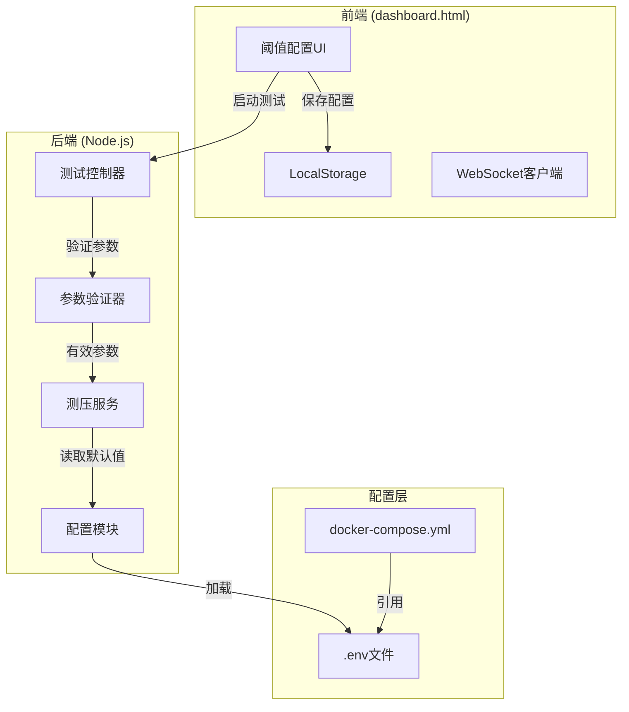

# 设计文档

## 概述

本设计实现前端阈值配置功能，将自动测压模式的成功率阈值和最大连续失败次数配置从环境变量迁移到前端界面。用户可以在测压控制台中直接配置这些参数，配置仅对自动测压模式生效，固定测压模式不显示这些配置项。

## 架构



## 组件和接口

### 1. 前端组件 (dashboard.html)

#### 1.1 阈值配置UI组件

新增配置区域，仅在自动测压模式下显示：

```html
<div id="autoThresholdGroup" style="display: none;">
    <h3>自动测压阈值配置</h3>
    <div class="form-grid">
        <div class="form-group">
            <label>成功率阈值 (%)</label>
            <input type="number" id="successThreshold" value="75" min="0" max="100">
            <small>低于此成功率判定为过载，0表示不判定</small>
        </div>
        <div class="form-group">
            <label>最大连续失败次数</label>
            <input type="number" id="maxFailures" value="20" min="0">
            <small>连续失败达到此次数判定为过载，0表示不判定</small>
        </div>
    </div>
</div>
```

#### 1.2 模式切换逻辑

```javascript
// 切换测压模式时显示/隐藏阈值配置
function updateRPMMode(mode) {
    const autoThresholdGroup = document.getElementById('autoThresholdGroup');
    if (mode === 'auto') {
        autoThresholdGroup.style.display = 'block';
    } else {
        autoThresholdGroup.style.display = 'none';
    }
}
```

#### 1.3 配置持久化

```javascript
// 保存配置到localStorage
function saveConfig() {
    const config = {
        successThreshold: parseInt(document.getElementById('successThreshold').value) || 75,
        maxFailures: parseInt(document.getElementById('maxFailures').value) || 20,
        // ... 其他配置
    };
    localStorage.setItem('autoceya_config', JSON.stringify(config));
}

// 加载配置
function loadSavedConfig() {
    const saved = localStorage.getItem('autoceya_config');
    if (saved) {
        const config = JSON.parse(saved);
        document.getElementById('successThreshold').value = config.successThreshold ?? 75;
        document.getElementById('maxFailures').value = config.maxFailures ?? 20;
    }
}
```

### 2. 后端组件

#### 2.1 参数验证器 (src/middlewares/validator.js)

扩展 `validateStartTest` 函数：

```javascript
const validateStartTest = (req, res, next) => {
    // ... 现有验证逻辑
    
    // 验证阈值参数（仅自动模式需要）
    if (mode === 'auto') {
        const { successThreshold, maxFailures } = req.body;
        
        if (successThreshold !== undefined) {
            const threshold = Number(successThreshold);
            if (isNaN(threshold) || threshold < 0 || threshold > 100) {
                throw new AppError('成功率阈值必须在0-100之间', 400);
            }
        }
        
        if (maxFailures !== undefined) {
            const failures = Number(maxFailures);
            if (isNaN(failures) || failures < 0 || !Number.isInteger(failures)) {
                throw new AppError('最大连续失败次数必须为非负整数', 400);
            }
        }
    }
    
    next();
};
```

#### 2.2 测压服务 (src/services/stressTestService.js)

修改 `start` 方法和 `checkOverload` 方法：

```javascript
start(testConfig) {
    // ... 现有逻辑
    
    this.testState = {
        // ... 现有状态
        thresholds: {
            successThreshold: testConfig.successThreshold ?? config.stressTest.successThreshold,
            maxFailures: testConfig.maxFailures ?? config.stressTest.maxConsecutiveFailures,
        },
    };
}

checkOverload() {
    if (this.testState.mode === 'fixed') {
        return { overloaded: false };
    }
    
    const { successThreshold, maxFailures } = this.testState.thresholds;
    const stats = this.testState.stats;
    const minuteStats = this.testState.currentMinuteStats;
    
    // 条件1: 成功率判定（0表示不判定）
    if (successThreshold > 0 && minuteStats.totalRequests >= 10 && 
        minuteStats.successRate < successThreshold) {
        return {
            overloaded: true,
            reason: `本分钟成功率(${minuteStats.successRate}%)低于阈值(${successThreshold}%)`,
        };
    }
    
    // 条件2: 连续失败判定（0表示不判定）
    if (maxFailures > 0 && stats.consecutiveFailures >= maxFailures) {
        return {
            overloaded: true,
            reason: `连续失败${stats.consecutiveFailures}次`,
        };
    }
    
    // ... 响应时间判定保持不变
}
```

### 3. 配置层

#### 3.1 docker-compose.yml 修改

```yaml
environment:
  - PORT=${PORT:-8998}
  - AUTH_SECRET=${AUTH_SECRET:-your_secure_password_here}
  - DEFAULT_SUCCESS_THRESHOLD=${DEFAULT_SUCCESS_THRESHOLD:-75}
  - DEFAULT_MAX_FAILURES=${DEFAULT_MAX_FAILURES:-20}
  - DEFAULT_RESPONSE_TIME_THRESHOLD=${DEFAULT_RESPONSE_TIME_THRESHOLD:-150000}
```

## 数据模型

### 测试配置请求体

```typescript
interface StartTestRequest {
    // 现有字段
    mode: 'fixed' | 'auto';
    rpm?: number;
    url: string;
    modelName: string;
    apiKey: string;
    testPrompt?: string;
    promptMode: 'fixed' | 'random';
    randomPrompts?: string[];
    requestType: 'stream' | 'non-stream';
    testDuration?: number;
    providerType: 'gemini' | 'openai' | 'claude';
    
    // 新增字段（仅自动模式使用）
    successThreshold?: number;  // 0-100，0表示不判定
    maxFailures?: number;       // 非负整数，0表示不判定
}
```

### 测试状态

```typescript
interface TestState {
    // 现有字段...
    
    // 新增阈值配置
    thresholds: {
        successThreshold: number;
        maxFailures: number;
    };
}
```

## 正确性属性

*属性是系统在所有有效执行中应保持为真的特征或行为——本质上是关于系统应该做什么的形式化陈述。属性作为人类可读规范和机器可验证正确性保证之间的桥梁。*

### Property 1: 阈值为0时跳过判定
*对于任意* 测试状态，当成功率阈值设置为0时，checkOverload函数不应因成功率触发过载判定
**验证: 需求 1.3**

### Property 2: 连续失败阈值为0时跳过判定
*对于任意* 测试状态，当最大连续失败次数设置为0时，checkOverload函数不应因连续失败触发过载判定
**验证: 需求 1.4**

### Property 3: 成功率阈值范围验证
*对于任意* 成功率阈值输入值，验证函数应接受0-100范围内的值，拒绝范围外的值
**验证: 需求 2.2, 6.1**

### Property 4: 最大失败次数验证
*对于任意* 最大连续失败次数输入值，验证函数应接受非负整数，拒绝负数和非整数
**验证: 需求 2.3, 6.2**

### Property 5: 前端配置覆盖默认值
*对于任意* 有效的阈值配置，当前端传递阈值参数时，测压服务应使用前端值而非环境变量默认值
**验证: 需求 3.2**

### Property 6: 未传递参数时使用默认值
*对于任意* 启动测试请求，当未传递阈值参数时，测压服务应使用环境变量中的默认值
**验证: 需求 3.3**

### Property 7: 过载检测使用配置阈值
*对于任意* 自动测压状态，checkOverload函数应使用testState中配置的阈值进行判定，而非全局配置
**验证: 需求 3.4**

## 错误处理

### 前端错误处理

| 错误场景 | 处理方式 |
|---------|---------|
| 成功率阈值超出范围 | 显示错误提示，阻止表单提交 |
| 最大失败次数为负数 | 显示错误提示，阻止表单提交 |
| 最大失败次数为小数 | 自动取整或显示错误提示 |
| localStorage不可用 | 降级处理，不保存配置 |

### 后端错误处理

| 错误场景 | HTTP状态码 | 错误消息 |
|---------|-----------|---------|
| 成功率阈值超出范围 | 400 | 成功率阈值必须在0-100之间 |
| 最大失败次数为负数 | 400 | 最大连续失败次数必须为非负整数 |
| 最大失败次数为小数 | 400 | 最大连续失败次数必须为非负整数 |

## 测试策略

### 单元测试

使用 Jest 作为测试框架。

**测试范围：**
1. 参数验证函数测试
2. checkOverload 函数测试
3. 配置覆盖逻辑测试

### 属性测试

使用 fast-check 作为属性测试库。

**测试要求：**
- 每个属性测试运行至少100次迭代
- 每个属性测试必须标注对应的正确性属性编号
- 格式: `**Feature: frontend-threshold-config, Property {number}: {property_text}**`

**测试用例：**

```javascript
// Property 1: 阈值为0时跳过判定
// **Feature: frontend-threshold-config, Property 1: 阈值为0时跳过判定**
test('当成功率阈值为0时，不应因成功率触发过载', () => {
    fc.assert(fc.property(
        fc.float({ min: 0, max: 100 }), // 任意成功率
        (successRate) => {
            const result = checkOverload({
                thresholds: { successThreshold: 0, maxFailures: 10 },
                currentMinuteStats: { successRate, totalRequests: 100 },
                stats: { consecutiveFailures: 0 }
            });
            // 不应因成功率触发过载
            return !result.overloaded || !result.reason.includes('成功率');
        }
    ), { numRuns: 100 });
});
```

### 集成测试

1. 前端到后端的完整流程测试
2. WebSocket 状态同步测试
3. Docker 环境变量读取测试（手动验证）
