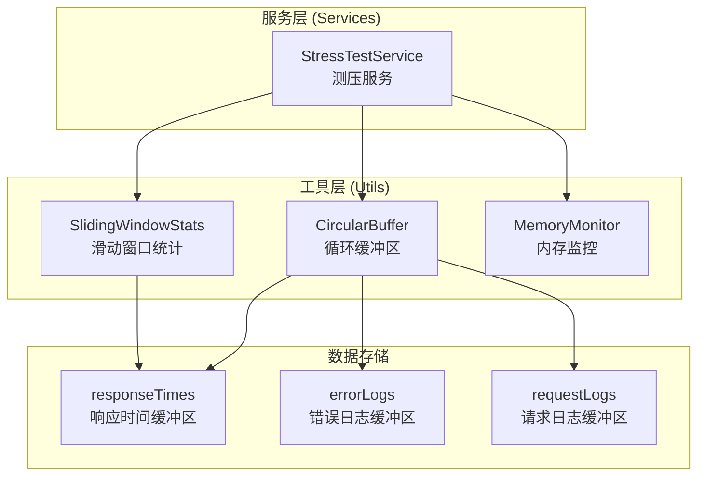

# 设计文档

## 概述

本设计文档描述了 AutoCeya 压力测试系统的性能优化方案。主要通过实现循环缓冲区（Circular Buffer）来解决长时间测试时内存无限增长的问题，并通过滑动窗口统计和内存监控来提升系统的稳定性和可观测性。

## 架构



## 组件和接口

### 1. CircularBuffer 类

循环缓冲区工具类，用于存储固定数量的元素。

```javascript
/**
 * 循环缓冲区类
 * @template T 元素类型
 */
class CircularBuffer {
  /**
   * 创建循环缓冲区
   * @param {number} capacity - 缓冲区容量
   */
  constructor(capacity) {}
  
  /**
   * 添加元素到缓冲区
   * @param {T} item - 要添加的元素
   */
  push(item) {}
  
  /**
   * 获取所有有效元素（按时间顺序）
   * @returns {T[]} 元素数组
   */
  getAll() {}
  
  /**
   * 获取数值元素的平均值
   * @returns {number} 平均值，空缓冲区返回 0
   */
  getAverage() {}
  
  /**
   * 获取数值元素的总和
   * @returns {number} 总和
   */
  getSum() {}
  
  /**
   * 清空缓冲区
   */
  clear() {}
  
  /**
   * 获取当前元素数量
   * @returns {number} 元素数量
   */
  get count() {}
  
  /**
   * 获取缓冲区容量
   * @returns {number} 容量
   */
  get capacity() {}
  
  /**
   * 检查缓冲区是否已满
   * @returns {boolean} 是否已满
   */
  isFull() {}
}
```

### 2. SlidingWindowStats 类

滑动窗口统计类，用于高效计算统计数据。

```javascript
/**
 * 滑动窗口统计类
 * 使用 O(1) 时间复杂度更新统计数据
 */
class SlidingWindowStats {
  /**
   * 创建滑动窗口统计
   * @param {number} windowSize - 窗口大小
   */
  constructor(windowSize) {}
  
  /**
   * 添加新值
   * @param {number} value - 要添加的值
   */
  add(value) {}
  
  /**
   * 获取平均值
   * @returns {number} 平均值
   */
  getAverage() {}
  
  /**
   * 获取总和
   * @returns {number} 总和
   */
  getSum() {}
  
  /**
   * 获取当前样本数量
   * @returns {number} 样本数量
   */
  get count() {}
  
  /**
   * 重置统计数据
   */
  reset() {}
}
```

### 3. MemoryMonitor 类

内存监控类，用于监控和管理系统内存使用。

```javascript
/**
 * 内存监控类
 */
class MemoryMonitor {
  /**
   * 创建内存监控器
   * @param {Object} options - 配置选项
   * @param {number} options.warningThreshold - 警告阈值（字节）
   * @param {number} options.criticalThreshold - 临界阈值（字节）
   * @param {number} options.checkInterval - 检查间隔（毫秒）
   */
  constructor(options) {}
  
  /**
   * 启动监控
   */
  start() {}
  
  /**
   * 停止监控
   */
  stop() {}
  
  /**
   * 获取当前内存使用情况
   * @returns {Object} 内存使用统计
   */
  getMemoryUsage() {}
  
  /**
   * 手动触发内存检查
   */
  check() {}
}
```

## 数据模型

### 内存使用统计

```javascript
{
  heapUsed: number,      // 已使用堆内存（字节）
  heapTotal: number,     // 总堆内存（字节）
  external: number,      // 外部内存（字节）
  rss: number,           // 常驻内存集（字节）
  heapUsedMB: number,    // 已使用堆内存（MB）
  heapTotalMB: number,   // 总堆内存（MB）
  timestamp: string,     // 时间戳
}
```

## 正确性属性

*属性是一种特征或行为，应该在系统的所有有效执行中保持为真——本质上是关于系统应该做什么的形式化陈述。属性作为人类可读规范和机器可验证正确性保证之间的桥梁。*

### Property 1: 缓冲区大小限制

*对于任意* 循环缓冲区和任意数量的元素，当添加的元素数量超过容量时，缓冲区的实际元素数量应该等于容量。

**验证: 需求 1.1, 4.1, 4.2, 5.1**

### Property 2: 最旧数据被覆盖

*对于任意* 已满的循环缓冲区，当添加新元素时，最旧的元素应该被移除，且缓冲区大小保持不变。

**验证: 需求 1.2, 4.3**

### Property 3: 平均值计算正确性

*对于任意* 包含数值元素的循环缓冲区，getAverage() 返回的值应该等于所有元素之和除以元素数量。

**验证: 需求 1.3, 5.4**

### Property 4: 元素顺序保持

*对于任意* 循环缓冲区和按顺序添加的元素序列，getAll() 返回的数组应该保持元素的添加顺序（最旧的在前）。

**验证: 需求 5.3**

### Property 5: 清空操作正确性

*对于任意* 非空循环缓冲区，调用 clear() 后，count 应该为 0，getAll() 应该返回空数组。

**验证: 需求 5.5**

### Property 6: 滑动窗口平均值一致性

*对于任意* 滑动窗口统计和数值序列，getAverage() 返回的值应该等于窗口内所有值的算术平均值。

**验证: 需求 2.1**

## 错误处理

1. **无效容量**: 创建缓冲区时，如果容量小于 1，抛出错误
2. **空缓冲区平均值**: 空缓冲区调用 getAverage() 返回 0，不抛出错误
3. **内存监控失败**: 如果获取内存信息失败，记录错误日志但不中断程序

## 测试策略

### 单元测试

- 测试 CircularBuffer 的所有方法
- 测试 SlidingWindowStats 的所有方法
- 测试 MemoryMonitor 的启动和停止

### 属性测试

使用 `fast-check` 库进行属性测试：

1. **缓冲区大小限制属性测试**: 生成随机容量和随机数量的元素，验证缓冲区大小不超过容量
2. **最旧数据覆盖属性测试**: 生成随机元素序列，验证最旧元素被正确覆盖
3. **平均值计算属性测试**: 生成随机数值数组，验证平均值计算正确
4. **元素顺序属性测试**: 生成随机元素序列，验证返回顺序正确
5. **清空操作属性测试**: 生成随机缓冲区状态，验证清空后状态正确
6. **滑动窗口属性测试**: 生成随机数值序列，验证滑动窗口平均值正确

### 集成测试

- 测试 StressTestService 使用新的缓冲区后的行为
- 测试 /metrics 端点返回正确的内存统计
