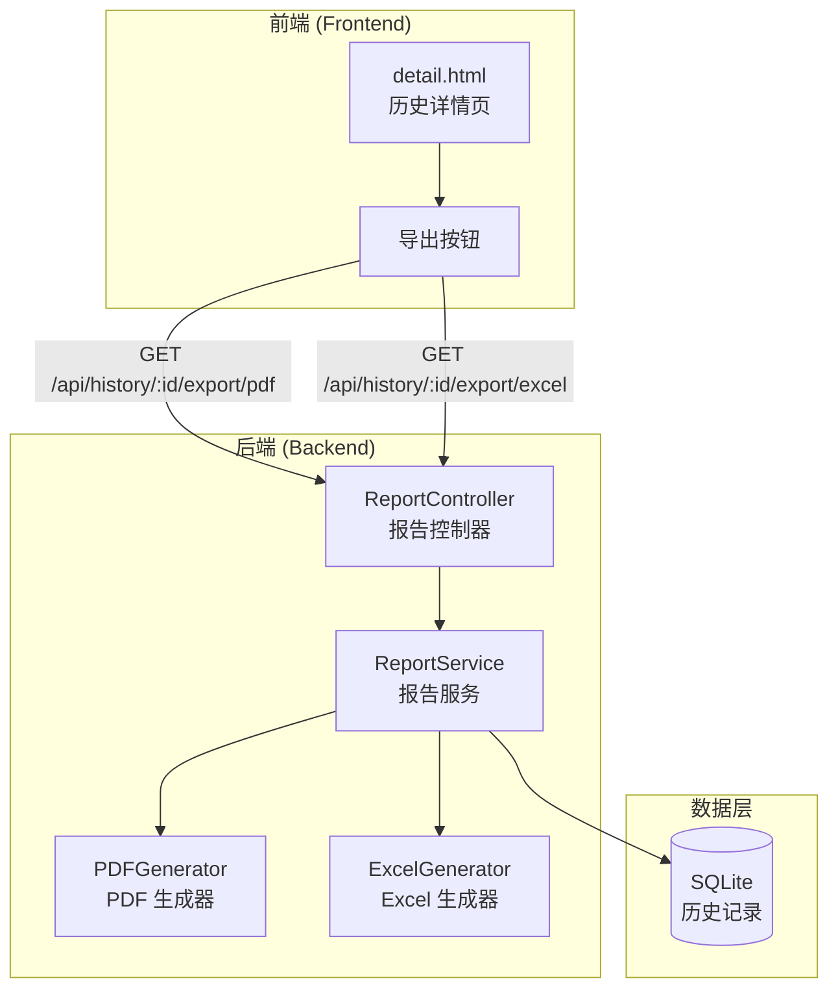

# 设计文档

## 概述

本设计文档描述了 AutoCeya 压力测试系统的测试报告导出功能。支持将测试结果导出为 PDF 和 Excel 格式，通过后端 API 生成文件并返回给前端下载。

## 架构



## 组件和接口

### 1. ReportService 类

报告生成服务，负责协调 PDF 和 Excel 生成。

```javascript
/**
 * 报告服务类
 */
class ReportService {
  /**
   * 生成 PDF 报告
   * @param {Object} historyData - 历史记录数据
   * @returns {Buffer} PDF 文件缓冲区
   */
  async generatePDF(historyData) {}
  
  /**
   * 生成 Excel 报告
   * @param {Object} historyData - 历史记录数据
   * @returns {Buffer} Excel 文件缓冲区
   */
  async generateExcel(historyData) {}
  
  /**
   * 生成文件名
   * @param {string} modelName - 模型名称
   * @param {string} format - 文件格式 (pdf/xlsx)
   * @returns {string} 文件名
   */
  generateFileName(modelName, format) {}
  
  /**
   * 清理文件名中的特殊字符
   * @param {string} name - 原始名称
   * @returns {string} 清理后的名称
   */
  sanitizeFileName(name) {}
}
```

### 2. PDFGenerator 类

PDF 文件生成器，使用 pdfkit 库。

```javascript
/**
 * PDF 生成器类
 */
class PDFGenerator {
  /**
   * 生成 PDF 文档
   * @param {Object} data - 报告数据
   * @returns {Buffer} PDF 缓冲区
   */
  generate(data) {}
  
  /**
   * 添加标题
   * @param {PDFDocument} doc - PDF 文档
   * @param {string} title - 标题文本
   */
  addTitle(doc, title) {}
  
  /**
   * 添加测试配置信息
   * @param {PDFDocument} doc - PDF 文档
   * @param {Object} config - 配置数据
   */
  addConfigSection(doc, config) {}
  
  /**
   * 添加统计数据
   * @param {PDFDocument} doc - PDF 文档
   * @param {Object} stats - 统计数据
   */
  addStatsSection(doc, stats) {}
  
  /**
   * 添加分钟统计表格
   * @param {PDFDocument} doc - PDF 文档
   * @param {Array} minuteStats - 分钟统计数组
   */
  addMinuteStatsTable(doc, minuteStats) {}
  
  /**
   * 添加错误摘要
   * @param {PDFDocument} doc - PDF 文档
   * @param {Object} errors - 错误摘要
   */
  addErrorSummary(doc, errors) {}
}
```

### 3. ExcelGenerator 类

Excel 文件生成器，使用 exceljs 库。

```javascript
/**
 * Excel 生成器类
 */
class ExcelGenerator {
  /**
   * 生成 Excel 工作簿
   * @param {Object} data - 报告数据
   * @returns {Buffer} Excel 缓冲区
   */
  async generate(data) {}
  
  /**
   * 创建测试摘要工作表
   * @param {Workbook} workbook - 工作簿
   * @param {Object} data - 报告数据
   */
  createSummarySheet(workbook, data) {}
  
  /**
   * 创建分钟统计工作表
   * @param {Workbook} workbook - 工作簿
   * @param {Array} minuteStats - 分钟统计数组
   */
  createMinuteStatsSheet(workbook, minuteStats) {}
  
  /**
   * 创建错误详情工作表
   * @param {Workbook} workbook - 工作簿
   * @param {Object} errors - 错误摘要
   */
  createErrorSheet(workbook, errors) {}
}
```

### 4. API 端点

```
GET /api/history/:id/export/pdf
  - 返回: application/pdf
  - 响应头: Content-Disposition: attachment; filename="..."

GET /api/history/:id/export/excel
  - 返回: application/vnd.openxmlformats-officedocument.spreadsheetml.sheet
  - 响应头: Content-Disposition: attachment; filename="..."
```

## 数据模型

### 报告数据结构

```javascript
{
  // 基本信息
  id: number,
  startTime: string,
  endTime: string,
  duration: number,
  
  // 测试配置
  testUrl: string,
  modelName: string,
  testMode: string,
  promptMode: string,
  requestType: string,
  targetRPM: number,
  maxRPM: number,
  
  // 统计数据
  totalRequests: number,
  successCount: number,
  failureCount: number,
  successRate: number,
  avgResponseTime: number,
  stopReason: string,
  
  // 详细数据
  minuteStats: Array<{
    timestamp: string,
    successCount: number,
    failureCount: number,
    rpm: number,
  }>,
  errorSummary: Object,
}
```

## 正确性属性

*属性是一种特征或行为，应该在系统的所有有效执行中保持为真——本质上是关于系统应该做什么的形式化陈述。属性作为人类可读规范和机器可验证正确性保证之间的桥梁。*

### Property 1: PDF 报告内容完整性

*对于任意* 有效的历史记录数据，生成的 PDF 报告应该包含测试配置（URL、模型、模式、RPM）、统计数据（总请求数、成功率、平均响应时间）、分钟统计和错误摘要。

**验证: 需求 1.2, 1.3, 1.4, 1.5**

### Property 2: Excel 报告结构完整性

*对于任意* 有效的历史记录数据，生成的 Excel 文件应该包含三个工作表：测试摘要、分钟统计、错误详情，且每个工作表包含正确的数据。

**验证: 需求 2.2, 2.3, 2.4**

### Property 3: 文件名格式正确性

*对于任意* 模型名称和日期时间，生成的文件名应该符合格式 `autoceya_report_{模型名}_{日期时间}.{扩展名}`，且特殊字符被替换为下划线。

**验证: 需求 3.1, 3.2**

## 错误处理

1. **历史记录不存在**: 返回 404 错误
2. **PDF 生成失败**: 返回 500 错误，记录详细日志
3. **Excel 生成失败**: 返回 500 错误，记录详细日志
4. **数据格式错误**: 返回 400 错误，说明数据问题

## 测试策略

### 单元测试

- 测试 sanitizeFileName 方法
- 测试 generateFileName 方法
- 测试 PDF 各部分生成方法
- 测试 Excel 各工作表生成方法

### 属性测试

使用 `fast-check` 库：

1. **PDF 内容完整性测试**: 生成随机历史数据，验证 PDF 包含所有必需信息
2. **Excel 结构完整性测试**: 生成随机历史数据，验证 Excel 包含所有工作表
3. **文件名格式测试**: 生成随机模型名（包含特殊字符），验证文件名格式正确

### 集成测试

- 测试 API 端点返回正确的 Content-Type
- 测试不存在的历史记录返回 404
- 测试导出文件可以正常打开

## 依赖

需要安装以下 npm 包：
- `pdfkit`: PDF 生成
- `exceljs`: Excel 生成
